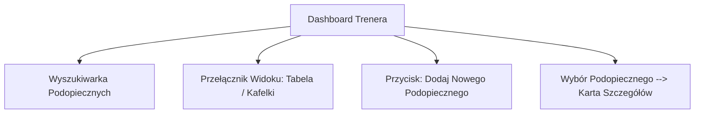
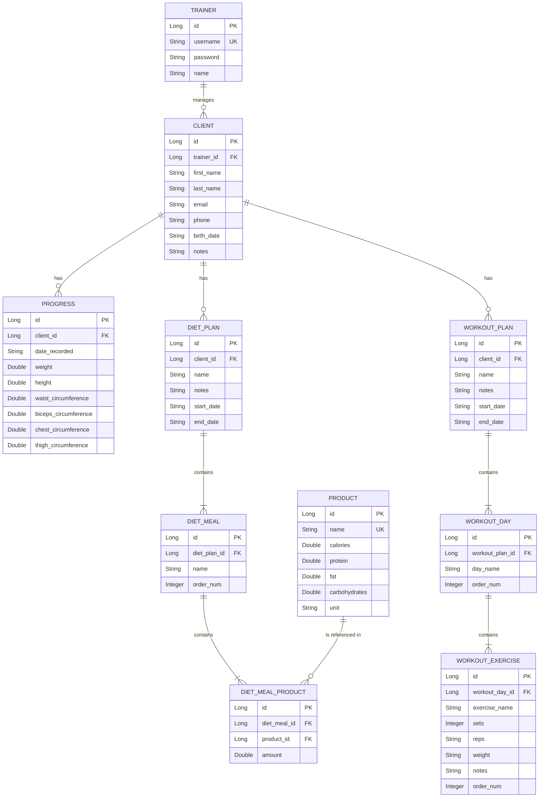
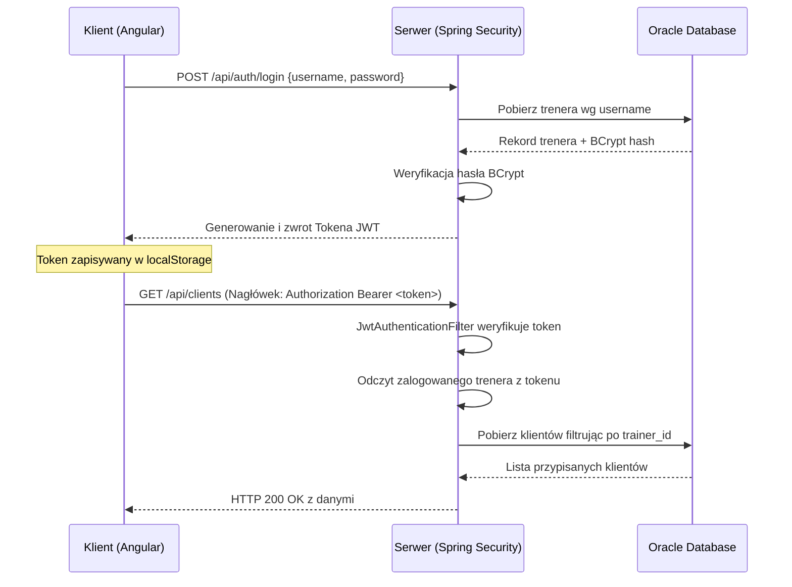

# Dokumentacja Biznesowa i Techniczna — DietAppOnSteroids

Niniejszy dokument stanowi kompletne kompendium wiedzy o systemie **DietAppOnSteroids**, podzielone na przystępną część biznesową (dla użytkownika końcowego/trenera) oraz szczegółową część techniczną (dla programisty utrzymującego lub rozwijającego kod).

---

## SPIS TREŚCI
1. [Wprowadzenie i Cel Systemu](#wprowadzenie-i-cel-systemu)
2. [Część I: Dokumentacja Biznesowa (Dla Użytkownika)](#część-i-dokumentacja-biznesowa-dla-użytkownika)
   - [Zarządzanie Podopiecznymi](#zarządzanie-podopiecznymi)
   - [Śledzenie Postępów](#śledzenie-postępów)
   - [Kreator Wielu Diet z Terminami](#kreator-wielu-diet-z-terminami)
   - [Kreator Treningów z Czasem Obowiązywania](#kreator-treningów-z-czasem-obowiązywania)
   - [Izolacja Trenerów (Multi-Tenancy)](#izolacja-trenerów-multi-tenancy)
3. [Część II: Dokumentacja Techniczna (Dla Programisty)](#część-ii-dokumentacja-techniczna-dla-programisty)
   - [Architektura Systemu](#architektura-systemu)
   - [Struktura i Model Bazy Danych](#struktura-i-model-bazy-danych)
   - [Bezpieczeństwo i Przepływ JWT](#bezpieczeństwo-i-przepływ-jwt)
   - [Struktura Kodu i Refaktoryzacja Frontendu](#struktura-kodu-i-refaktoryzacja-frontendu)
   - [Instrukcja Wdrożenia i Uruchomienia](#instrukcja-wdrożenia-i-uruchomienia)

---

## Wprowadzenie i Cel Systemu

**DietAppOnSteroids** to nowoczesna, responsywna aplikacja webowa w architekturze klient-serwer, stworzona z myślą o profesjonalnych trenerach personalnych i dietetykach. Głównym zadaniem systemu jest automatyzacja codziennej pracy trenera poprzez:
* Centralizację danych kontaktowych i zdrowotnych podopiecznych.
* Monitorowanie parametrów antropometrycznych (masa ciała, obwody) i ich wizualizację.
* Szybkie i precyzyjne układanie planów dietetycznych na bazie wbudowanego słownika produktów z kalkulacją makroskładników w czasie rzeczywistym.
* Rozpisywanie zindywidualizowanych planów treningowych z podziałem na dni oraz precyzyjne parametry serii (ciężar, powtórzenia, tempo).
* Bezpieczną izolację danych — każdy trener widzi wyłącznie własnych podopiecznych.

Aplikacja wyróżnia się wyjątkową estetyką: jasny motyw graficzny oparty na technologii *glassmorphism* (efekt szklanych kart), pastelowo-pomarańczowe akcenty HSL oraz płynne mikro-animacje gwarantują doskonałe wrażenia użytkowe (User Experience).

---

## Część I: Dokumentacja Biznesowa (Dla Użytkownika)

Jako trener korzystający z systemu otrzymujesz do dyspozycji komplet narzędzi ułatwiających prowadzenie klientów. Poniżej znajduje się opis kluczowych modułów.

### Zarządzanie Podopiecznymi

Po zalogowaniu trafiasz na panel główny (Dashboard) prezentujący listę Twoich aktywnych podopiecznych. 



* **Wyszukiwarka:** Działa w czasie rzeczywistym. Wpisując imię, nazwisko lub telefon, system natychmiast filtruje listę klientów.
* **Przełącznik widoków:** Możesz przełączać sposób prezentacji danych za pomocą jednego kliknięcia:
  * *Widok tabeli (domyślny):* Klasyczna, przejrzysta tabela z metryką (imię, nazwisko, wiek wyliczany z daty urodzenia, e-mail, telefon).
  * *Widok kafelków:* Nowoczesne, szklane karty idealne na tablety i ekrany dotykowe.
* **Dodawanie Podopiecznego:** Kliknięcie przycisku otwiera estetyczny modal. Musisz podać imię, nazwisko, datę urodzenia (aplikacja sama wyliczy wiek), e-mail oraz telefon kontaktowy. Możesz też wpisać wstępne notatki (np. alergie, cele sylwetkowe).

---

### Śledzenie Postępów

Po wejściu w kartę konkretnego klienta i wybraniu zakładki **Postępy i Wykresy** zyskujesz dostęp do modułu antropometrii.

> [!NOTE]
> System pozwala wprowadzać pomiary: masa ciała (kg), wzrost (cm), obwód pasa (cm), obwód bicepsa (cm), obwód klatki piersiowej (cm) oraz obwód uda (cm).

* **Formularz Pomiaru:** Po lewej stronie ekranu znajduje się formularz. Obowiązkowym polem jest data pomiaru (system pozwala na wprowadzanie danych wstecznych). Pozostałe pola są opcjonalne.
* **Interaktywny Wykres:** Po prawej stronie generuje się automatyczny wykres liniowy. Każdy parametr (np. waga, obwód pasa) ma przypisany unikalny, pastelowy kolor. Najechanie kursorem na punkt wykresu wyświetla szczegółowy dymek z dokładnymi wartościami.
* **Historia Pomiarów:** Pod spodem znajduje się chronologiczna lista wszystkich dokonanych wpisów z opcją trwałego usunięcia błędnego rekordu (ikona czerwonego kosza).

---

### Kreator Wielu Diet z Terminami

W zakładce **Plan Diety** możesz zarządzać planami żywieniowymi podopiecznego. Aplikacja wspiera periodyzację diety.

* **Wiele Planów Żywieniowych:** Możesz stworzyć dowolną liczbę diet (np. "Redukcja - Wariant A", "Masa weekendowa"). Pasek wyboru na górze strony ułatwia szybkie przełączanie.
* **Czas Obowiązywania:** Każda dieta posiada pola daty **Od** oraz **Do**. Pozwala to zaplanować żywienie z wyprzedzeniem i kontrolować harmonogram klienta.
* **Dynamiczne Makro w Czasie Rzeczywistym:** Szklany pasek podsumowania automatycznie zlicza i wyświetla sumę kalorii (kcal), białka (g), tłuszczów (g) i węglowodanów (g) dla całego dnia w miarę modyfikowania gramatury produktów.
* **Baza Produktów (Lewy Panel):** Przeszukuj bazę artykułów spożywczych. Jeśli w bazie nie ma produktu, którego potrzebujesz, kliknij **+ Nowy produkt** i dodaj go do wspólnego słownika, określając jego kaloryczność i makroskładniki na 100g.
* **Kompozycja Posiłków (Prawy Panel):** Twórz posiłki (Śniadanie, Obiad, Kolacja itd.) lub dodawaj własne. Wystarczy wybrać odpowiedni posiłek z rozwijanej listy przy produkcie, a trafi on do menu. Wpisz wagę produktu w gramach (g), a system natychmiast przeliczy kaloryczność tego składnika oraz całego posiłku.

---

### Kreator Treningów z Czasem Obowiązywania

Zakładka **Trening** działa na podobnej zasadzie jak kreator diety.

* **Wieloplanowość i Kalendarz:** Twórz i przypisuj wiele planów treningowych z określonym okresem ważności (daty obowiązywania).
* **Dni Treningowe:** Dodawaj dni treningowe (np. "Dzień A - Push", "Dzień B - Pull") jednym przyciskiem.
* **Tabele Ćwiczeń:** W ramach każdego dnia tworzy się edytowalna tabela. Możesz w niej w locie modyfikować:
  * Nazwę ćwiczenia (np. "Przysiad ze sztangą")
  * Liczbę serii (np. `4`)
  * Powtórzenia (np. `8-10` lub `do załamania`)
  * Obciążenie (np. `100kg` lub `RPE 8`)
  * Wskazówki trenera (np. `90s przerwy, faza ekscentryczna 3 sekundy`)

---

### Izolacja Trenerów (Multi-Tenancy)

Dla zapewnienia prywatności i poufności danych osobowych wdrożono ścisłą izolację. Po zalogowaniu jako dany trener (np. **Zdzisiu Biceps**):
* Masz dostęp wyłącznie do swoich podopiecznych.
* Nie możesz podejrzeć danych klientów innego trenera (np. **Franka Klatki**), nawet jeśli ręcznie wpiszesz identyfikator innego klienta w pasku adresu przeglądarki. System zwróci wówczas komunikat o braku uprawnień.

---

## Część I: Dokumentacja Techniczna (Dla Programisty)

Ta sekcja zawiera architektoniczne i implementacyjne szczegóły aplikacji, niezbędne do jej sprawnego rozwoju i utrzymania.

### Architektura Systemu

System zaprojektowano w klasycznej trójwarstwowej strukturze z wyraźnym podziałem odpowiedzialności:

```
[ FRONTEND (Angular Standalone) ] <--- REST API (HTTPS + JWT) ---> [ BACKEND (Spring Boot) ] <---> [ BAZA DANYCH (Oracle 23c) ]
```

#### Frontend (Klient):
* **Technologia:** Angular 18 (aplikacja w pełni oparta na komponentach *Standalone*).
* **Stan:** Reaktywne zarządzanie stanem za pomocą Angular **Signals** (sygnałów), eliminujące potrzebę ręcznego odsubskrybowywania strumieni RxJS w wielu miejscach.
* **Wykresy:** Chart.js ze wsparciem dla płynnego skalowania responsywnego.
* **Stylizacja:** Czysty Vanilla CSS z wykorzystaniem zmiennych HSL (`styles.css` oraz lokalne arkusze stylów). Zastosowano efekt szklany (*glassmorphism*) za pomocą właściwości `backdrop-filter: blur(12px)`.

#### Backend (Serwer):
* **Technologia:** Spring Boot 3 z Java 17.
* **Zabezpieczenia:** Spring Security zabezpieczony bezstanową autoryzacją **JWT** (JSON Web Token). Hasła są szyfrowane jednokierunkowo algorytmem **BCrypt**.
* **Trwałość danych:** Spring Data JPA z Hibernate jako dostawcą ORM.
* **Baza danych:** Oracle Database 23c Free (PDB: `freepdb1`).

---

### Struktura i Model Bazy Danych

Relacyjny model danych w pełni odzwierciedla logikę biznesową z zachowaniem spójności referencyjnej.



#### Kluczowe aspekty encji JPA:
* **Kaskadowość (`CascadeType.ALL`) i `orphanRemoval = true`**: Stosowane w relacjach agregacyjnych (np. `DietPlan` -> `DietMeal` -> `DietMealProduct` oraz `WorkoutPlan` -> `WorkoutDay` -> `WorkoutExercise`). Dzięki temu usunięcie dnia treningowego lub posiłku automatycznie czyści powiązane rekordy podrzędne w bazie danych, nie pozostawiając sierot.
* **Wydajność pobierania (`FetchType.LAZY` / `FetchType.EAGER`)**: Relacje typu `@OneToMany` domyślnie wykorzystują pobieranie leniwe (`LAZY`) w celu optymalizacji obciążenia bazy danych. W miejscach krytycznych (np. pobieranie całego planu diety wraz z produktami) struktura jest ładowana za pomocą zapytań łączonych.

---

### Bezpieczeństwo i Przepływ JWT

Autoryzacja opiera się o standard JWT.



#### Bezpieczeństwo danych (Izolacja):
W serwerowych klasach biznesowych (np. `ClientService.java`) każda operacja odczytu, modyfikacji lub usunięcia jest weryfikowana pod kątem tożsamości zalogowanego trenera:
```java
public Client getClientForTrainer(Long clientId, String trainerUsername) {
    Client client = clientRepository.findById(clientId)
        .orElseThrow(() -> new ResourceNotFoundException("Client not found"));
    if (!client.getTrainer().getUsername().equals(trainerUsername)) {
        throw new AccessDeniedException("Brak dostępu do danych podopiecznego innego trenera.");
    }
    return client;
}
```

---

### Struktura Kodu i Refaktoryzacja Frontendu

Frontend przeszedł głęboką refaktoryzację w celu wydzielenia logiki ze zbyt dużego komponentu `ClientDetailComponent`. Został on podzielony na modularne, wysoce wyspecjalizowane subkomponenty:

#### Układ folderów w module `client-detail`:
```
src/app/components/client-detail/
├── client-detail.ts         <-- Komponent nadrzędny (Shell nawigacyjny)
├── client-detail.html       <-- Lekki szablon strukturalny z zakładkami
├── client-detail.css        <-- Współdzielony, bazowy arkusz stylów
├── profile/
│   ├── client-profile.ts    <-- Komponent edycji danych kontaktowych
│   └── client-profile.html
├── progress/
│   ├── client-progress.ts   <-- Zarządzanie pomiarami i wykresami Chart.js
│   └── client-progress.html
├── diet/
│   ├── client-diet.ts       <-- Panel układania diety z bazą produktów
│   └── client-diet.html
└── workout/
    ├── client-workout.ts    <-- Panel rozpisywania ćwiczeń i serii
    └── client-workout.html
```

#### Przekazywanie danych i współdzielenie stylów:
* **Style:** Każdy z subkomponentów współdzieli bazowy plik stylów nadrzędnych:
  ```typescript
  styleUrls: ['../client-detail.css']
  ```
  Zapewnia to identyczny wygląd (glassmorphic warm-white, pastelowe focusy) bez powielania regulels CSS.
* **Profile:** Komponent profilu korzysta z dwukierunkowego przepływu danych za pomocą sygnałów wejściowych oraz wyjściowych emiterów:
  ```typescript
  client = input.required<Client>();
  profileUpdated = output<Client>();
  ```
* **Postępy, Diety i Treningi:** Komponent nadrzędny przekazuje jedynie identyfikator podopiecznego `[clientId]="clientId()"`. Każdy z tych paneli samodzielnie odpowiada za pobieranie i zapisywanie swoich specyficznych danych z API, co znacząco zmniejsza obciążenie startowe (Lazy Activation).

---

### Instrukcja Wdrożenia i Uruchomienia

#### Wymagania wstępne (Prerequisites):
1. **JDK 17** lub nowsza wersja zainstalowana w systemie.
2. **Node.js** (wersja LTS, np. v18 lub nowsza) wraz z managerem `npm`.
3. **Oracle Database 23c Free** (z włączonym PDB o nazwie `freepdb1` uruchomionym lokalnie na porcie `1521`).

#### Krok 1: Przygotowanie bazy danych Oracle
Zaloguj się do bazy danych z uprawnieniami administratora i wykonaj skrypt:
```sql
CREATE USER diet_app IDENTIFIED BY oracle;
GRANT CONNECT, RESOURCE, UNLIMITED TABLESPACE TO diet_app;
```

#### Krok 2: Konfiguracja i start Backend (Spring Boot)
1. Sprawdź konfigurację połączenia z bazą w pliku `backend/src/main/resources/application.properties`:
   ```properties
   spring.datasource.url=jdbc:oracle:thin:@localhost:1521/freepdb1
   spring.datasource.username=diet_app
   spring.datasource.password=oracle
   spring.jpa.hibernate.ddl-auto=update
   ```
2. Wejdź do folderu `backend/` i uruchom polecenie:
   ```bash
   mvn spring-boot:run
   ```
   *Serwer uruchomi się na porcie `8080` i automatycznie utworzy tabele oraz załaduje dane początkowe (konta trenerów, baza produktów, podopieczni).*

#### Krok 3: Instalacja i start Frontend (Angular)
1. Przejdź do katalogu `frontend/`.
2. Pobierz i zainstaluj wymagane biblioteki:
   ```bash
   npm install
   ```
3. Uruchom serwer deweloperski Angulara:
   ```bash
   npm start
   ```
4. Otwórz przeglądarkę pod adresem [http://localhost:4200](http://localhost:4200).

#### Konta testowe do logowania:
* **Trener Zdzisiek Biceps:** login: `zdzisiek`, hasło: `123456`
* **Trener Franek Klatka:** login: `franek`, hasło: `123456`
